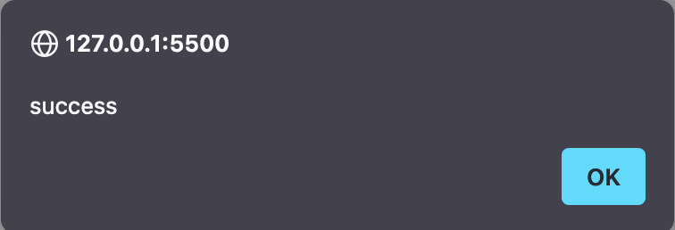

## Simple ERC721 Non-fungible Token (NFT) aucttion with Ethereum Solidity

The project demonstrates a siimple Non-fungible Token (NFT) auction use case that allows tokens to be minted for auctioning in the marketplace. The NFT mint comes from an existing project repo [1] which is used to deploy the auction contract and mint a random ERC721 token into a local hardhat blockchain. The NFT asset (a random JSON file) along with its metadata are stored in an Interplanetary File Service (IPFS), a decentralised file system on the web (node deployed locally via iPFS Desktop).

## Installation:

Follow the installation guide in the minty folder observing some slight changes below.

1. Install and start ipfs daemon with `ipfs daemon` or install an IPFS desktop, which should automatically start the service
2. Change http://localhost:5001 to http://127.0.0.1:5001 in minty/default.json
3. Run `./start-local-environment.sh`. If `./start-local-environment.sh` doesn't work, then start the node manually with `npx hardhat node`
   1. Ensure `npx hardhat noode` binds to hostname `127.0.0.1:8545` and not `::1:8545` (or use `npx hardhat node --hostname 127.0.0.1`)
4. Compile the contracts with: `npx hardhat compile`
5. Change name and symbol of the mint from JLP using command `minty deploy -o minty-deployment.json -n SolContract -s SOLC` (if you wish)

The project demos a simple auction workflow as follows

0. Ensure the installation steps above have been followed
1. Deploy the minty and auction contracts with `minty deploy -o minty-deployment.json -n SolContract -s SOLC`
2. Mint an NFT token with `minty mint ./auction.json` (using any file as the NFT asset)
3. Clear all accounts in your metamask via Settings -> Advanced -> Clear activity data
4. Deploy the NFT Web UI (base.html) (via Go Live in VS Code or otherwise)
5. Log into metamask owner/master account (accounnt 1)
6. Approve token mint into/for auction contract
    

7. Add a listing for nft token (listing 0)
   

8. Display info for listing 0
   

9. Login to account 2 (a random bidder)
10. Make a bid with at a price higher than allowed minimum (for listing 0)
    

11. Display info for listing 0 (shows the latest bid from step 10)
    

12. Login to account 3 (another bidder)
13. Make a bid with at a price higher than allowed minimum & previous bidder (for listing 0)
    
    
14. Login to account 2 (the first bidder)
15. withdrawing from the auction: first bidder withdraws their funds
    

16. Unit tests
    

[1] https://github.com/yusefnapora/minty
